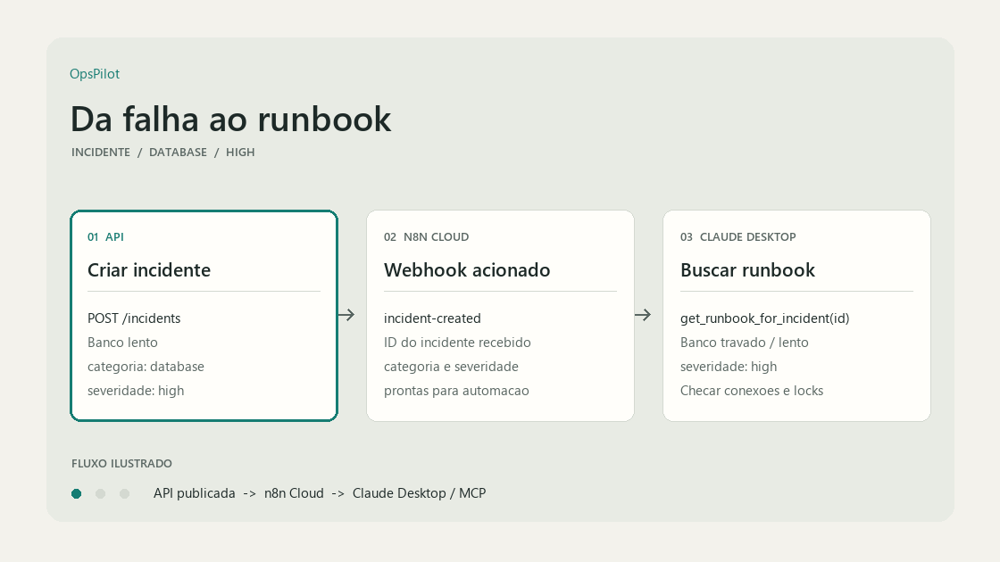

# OpsPilot

**Swagger local:** [http://localhost:8000/docs](http://localhost:8000/docs) | **Produção:** [https://opspilot-yme6.onrender.com/docs](https://opspilot-yme6.onrender.com/docs).

API de incidentes com Supabase, automação n8n, observabilidade, triagem com LLM (Gemini) e agente de IA via MCP. Dois usos de IA:

- **Triagem:** dado o título e a descrição de um incidente, o Gemini sugere categoria e severidade (veja [Triagem com LLM](#triagem-com-llm)).
- **Runbook via MCP:** pergunte em linguagem natural pro Claude "o que fazer com esse incidente de banco travado?" e o agente MCP busca automaticamente o runbook certo, pela categoria do incidente.



*Animação ilustrativa do fluxo. Em produção, API e banco (Render + Supabase) estão no ar; o webhook do n8n roda localmente até a configuração do n8n Cloud.*

## Testar em produção

Abra [/docs](https://opspilot-yme6.onrender.com/docs) e teste `GET /incidents`, `GET /runbooks/database` e `GET /health` livremente, sem chave. Os endpoints de escrita exigem chave e ficam restritos ao dono do projeto.

> No plano gratuito do Render, o serviço hiberna; a primeira requisição após inatividade pode demorar cerca de um minuto.

## Passo 1 — Subir Postgres e n8n

```bash
cd opspilot
docker compose up -d
```

Confere: `docker ps` deve mostrar `postgres` e `n8n` rodando.

## Passo 2 — Configurar variáveis

```bash
cp .env.example .env
```

Deixa como está para rodar local (aponta pro Postgres do docker-compose).

Para usar a triagem com LLM, preencha também `GEMINI_API_KEY` no `.env` (chave do Google AI Studio). As outras variáveis do Gemini estão listadas no `.env.example`. Sem a chave, a API sobe normalmente e só a triagem retorna erro.

> O `.env` nunca vai para o Git. No `.env.example` a chave fica vazia.

## Passo 3 — Instalar dependências e rodar a API

```bash
python -m venv venv
source venv/bin/activate  # Windows: venv\Scripts\activate
pip install -r requirements.txt
uvicorn app.main:app --reload
```

Abre http://localhost:8000/docs — Swagger já vem pronto (FastAPI gera sozinho).

> Rodando em outra porta (ex.: `--port 8001`)? Lembra de ajustar `OPSPILOT_API_URL` no Passo 8 e no `claude_desktop_config.json`.

## Passo 4 — Criar o workflow no n8n

1. Abre http://localhost:5678 (login: `admin` / `admin123`)
2. Cria um workflow novo
3. Nó 1: **Webhook** — método `POST`, path `incident-created` (tem que bater com `N8N_WEBHOOK_URL` do `.env`)
4. Nó 2: qualquer ação (Discord, Slack, ou até um nó "NoOp" pra começar)
5. Ativa o workflow (toggle no canto superior direito)

## Passo 5 — Testar o fluxo

```bash
curl -X POST http://localhost:8000/incidents \
  -H "x-api-key: troque-essa-chave" \
  -H "Content-Type: application/json" \
  -d '{"title": "API fora do ar", "severity": "high", "category": "network"}'
```

Se o n8n recebeu o webhook, o fluxo está fechado: API → Postgres → n8n.

Windows/PowerShell, use `Invoke-RestMethod` em vez de `curl`:

```powershell
Invoke-RestMethod -Uri "http://localhost:8000/incidents" -Method Post -Headers @{"x-api-key"="troque-essa-chave"} -ContentType "application/json" -Body '{"title": "API fora do ar", "severity": "high", "category": "network"}'
```

## Passo 6 — Observabilidade

- **Logs:** aparecem no terminal do uvicorn já em JSON (structlog)
- **Métricas:** http://localhost:8000/metrics (formato Prometheus)
- **Erros:** cria conta grátis em sentry.io, cria um projeto Python/FastAPI, cola o DSN em `SENTRY_DSN` no `.env`

## Passo 7 — Migrar para Supabase real (produção)

1. Cria projeto em supabase.com
2. Vai em **SQL Editor**, roda o conteúdo de `supabase/schema.sql` (schema completo, incluindo `incidents.category` e a tabela `runbooks` já populada)
3. Pega a connection string em **Project Settings → Database → Connection string** (modo "Transaction pooler")
4. Troca `DATABASE_URL` no `.env` pela do Supabase (troca `postgresql://` por `postgresql+asyncpg://`)

> `Base.metadata.create_all` cria tabelas novas, mas não atualiza tabelas já existentes. Para atualizar um projeto anterior, execute `supabase/migrations/20260928_add_runbook_severity.sql` no SQL Editor do Supabase.

## Categorias e runbooks

Cada incidente tem uma `category` (`database`, `deploy`, `network` ou `other`). A tabela `runbooks` guarda um playbook de passos por categoria — é isso que o agente MCP consulta.

`GET /runbooks/{category}` — retorna categoria, passos e severidade (404 se não existir). A ferramenta MCP `get_runbook_for_incident` busca o incidente e consulta esse endpoint, que lê a tabela `runbooks` no Supabase.

| Categoria  | Runbook seed no `schema.sql`? |
|------------|:------------------------------:|
| `database` | ✅ |
| `deploy`   | ✅ |
| `network`  | ✅ |
| `other`    | ❌ (adicionar manualmente) |

Pra adicionar um novo runbook, insere direto na tabela `runbooks` (colunas: `category`, `title`, `steps`, `severity`).

## Triagem com LLM

`POST /incidents/triage` recebe `title` e `description` e devolve uma sugestão de classificação:

```json
{
  "category": "network",
  "severity": "high",
  "reason": "texto curto explicando a escolha"
}
```

O endpoint só sugere: **não grava nada no banco**. Quem decide o que fazer com a sugestão é a pessoa (ou outro sistema).

**Como funciona** (`app/services/triage.py`):

- Chamada assíncrona ao Gemini com o SDK `google-genai`, com timeout de 30 segundos.
- A resposta é validada com Pydantic. `category` e `severity` só aceitam valores fixos (`Literal`); JSON fora do formato levanta `TriageError`, sem valor padrão "chutado".
- Até 2 tentativas, com 5 segundos de espera entre elas, apenas em erros 429 e 5xx. Erros como chave inválida (401/403) não são repetidos.
- Sem `GEMINI_API_KEY`, o erro é claro e acontece antes de chamar o SDK. A chave não aparece em logs nem em mensagens de erro.

**Critério de severidade** usado no prompt:

| Severidade | Critério |
|---|---|
| `critical` | produção fora ou perda de dados para todos |
| `high` | função principal quebrada, sem alternativa |
| `medium` | função secundária ou lentidão |
| `low` | sem impacto visível |

**Entrada não confiável:** `title` e `description` vêm de quem chama a API e entram no prompt do modelo, então alguém pode tentar manipular a resposta escrevendo instruções no título (prompt injection). O prompt delimita esses campos e instrui o modelo a ignorar instruções dentro deles. Como a saída é restrita a valores fixos, o pior caso é uma classificação errada, não uma ação indevida. Há casos de injection no eval para medir isso.

### Eval da triagem

Para saber se a triagem acerta, existe um conjunto pequeno de casos rotulados à mão, sem framework de eval, só Python.

- `eval/cases.json`: 24 incidentes com `expected_category` e `expected_severity`. Metade são relatos objetivos e metade ambíguos, escritos como uma pessoa escreveria num chamado, sem repetir o vocabulário do critério. Inclui 2 casos de prompt injection no título (`case-02` e `case-13`) e um par de controle: `case-02` tem a mesma descrição do `case-07`, com e sem a instrução maliciosa no título.
- Os rótulos foram revisados por mim, seguindo o critério de severidade acima, **antes** de rodar o eval. Casos ambíguos existem de propósito; discordância do modelo neles nem sempre é erro.
- Distribuição: `database` 3, `deploy` 7, `network` 6, `other` 8; severidade `critical` 6, `high` 8, `medium` 5, `low` 5.
- `eval/run_eval.py` roda os casos, mostra acerto de categoria e de severidade, lista os casos errados (esperado, obtido, motivo) e salva um JSON em `eval/resultados/`.

```bash
python eval/run_eval.py --start 0 --limit 8 --sleep 15
python eval/run_eval.py --start 8 --limit 8 --sleep 15
python eval/run_eval.py --start 16 --limit 8 --sleep 15
```

O plano gratuito do Gemini tem cota diária baixa, por isso o eval roda em lotes (`--start` e `--limit`). Se a cota acaba (429), o runner **para**, salva o resultado parcial e avisa em qual caso parou. O resumo sempre mostra "X de Y avaliados" e resultados parciais não devem ser usados como taxa de acerto.

**Resultado** (modelo: `TODO`, data: `TODO`):

| Métrica | Acertos |
|---|---|
| Categoria | TODO / 24 |
| Severidade | TODO / 24 |
| Par 02/07 (com e sem injection) | TODO |

*Onde o modelo errou e por quê:* TODO

## Passo 8 — Rodar o servidor MCP

```bash
export OPSPILOT_API_URL=http://localhost:8000
export OPSPILOT_API_KEY=troque-essa-chave
python mcp_server/server.py
```

> O servidor usa transporte stdio: ele sobe e fica esperando um cliente (como o Claude Desktop). Rodando direto no terminal, ele parece "travado", e `Ctrl+C` mostra um `KeyboardInterrupt`. Isso é normal.

> **Importante:** o `server.py` usa a API `FastMCP` da biblioteca `mcp` versão 1.x. A versão 2.x renomeou essa API (`FastMCP` → `MCPServer`) e quebra o código atual. Se der `ModuleNotFoundError: No module named 'mcp.server.fastmcp'`, fixa a versão:
>
> ```bash
> pip install "mcp[cli]<2"
> ```
>
> (o `requirements.txt` já vem com essa versão fixada — só é um problema se você instalar o pacote `mcp` manualmente, fora do `requirements.txt`.)

### Ferramentas disponíveis pro agente

| Ferramenta | O que faz |
|---|---|
| `list_incidents(status?)` | Lista incidentes, opcionalmente filtrando por status |
| `create_incident(title, severity?, category?)` | Cria um incidente |
| `resolve_incident(incident_id)` | Marca como resolvido |
| `get_runbook_for_incident(incident_id)` | Busca a categoria do incidente e retorna o runbook correspondente |

## Conectar no Claude Desktop

Edita (ou cria) o arquivo de config do Claude Desktop:

- **Windows:** `%APPDATA%\Claude\claude_desktop_config.json`
- **macOS:** `~/Library/Application Support/Claude/claude_desktop_config.json`

```json
{
  "mcpServers": {
    "opspilot": {
      "command": "python",
      "args": ["/caminho/completo/para/opspilot/mcp_server/server.py"],
      "env": {
        "OPSPILOT_API_URL": "http://localhost:8000",
        "OPSPILOT_API_KEY": "troque-essa-chave"
      }
    }
  }
}
```

> No Windows, use o python do seu venv (não o global) em `command`, algo como: `C:\caminho\para\opspilot\venv\Scripts\python.exe`

Reinicia o Claude Desktop por completo (confere se não ficou processo residente na bandeja do sistema) e pergunta:

> tem um incidente de banco travado, id — me diz o que fazer

O agente busca a categoria do incidente e devolve o runbook certo automaticamente.

## Deploy da API e n8n Cloud

1. Crie o projeto Supabase, execute `supabase/schema.sql` e aplique as migrações pendentes em `supabase/migrations/`.
2. No Render, crie um Web Service a partir deste repositório e faça o deploy pelo `Dockerfile`.
3. Configure no serviço da API as variáveis `DATABASE_URL` (URL do pooler Supabase usando `postgresql+asyncpg://`), `API_KEY` (segredo forte), `N8N_WEBHOOK_URL` (URL de produção do webhook n8n), `ENVIRONMENT=production` e, para habilitar a triagem, `GEMINI_API_KEY`.
4. Gere um domínio público para o serviço Render. A documentação ficará em `https://<dominio-gerado>/docs`.
5. No n8n Cloud, crie um workflow com um nó **Webhook** (`POST`, path `incident-created`) e ative-o. Copie a **Production URL** do nó e defina-a como `N8N_WEBHOOK_URL` no Render. O fluxo é API publicada → webhook do n8n Cloud.
6. Valide `https://<dominio-gerado>/health` e crie um incidente de teste para confirmar a execução do workflow.

O MCP do Claude Desktop deve usar o domínio público em `OPSPILOT_API_URL` e a mesma chave configurada em `API_KEY`. Nunca coloque segredos no repositório.

## CI/CD

O GitHub Actions executa automaticamente em todo push e pull request direcionado à branch `main`.

- **Testes Python:** configura Python 3.12, instala as dependências e roda a suíte completa com `pytest -q`. Cobre os endpoints REST, as ferramentas MCP e a triagem (resposta válida, JSON inválido, chave ausente e política de retry), sempre com o cliente Gemini simulado, sem chamar a API real.
- **Docker Compose:** valida o arquivo `docker-compose.yml` com `docker compose config` usando apenas valores placeholder.

Para reproduzir o job de testes localmente:

```bash
pip install -r requirements.txt
pip install pytest pytest-asyncio aiosqlite
pytest -q
```